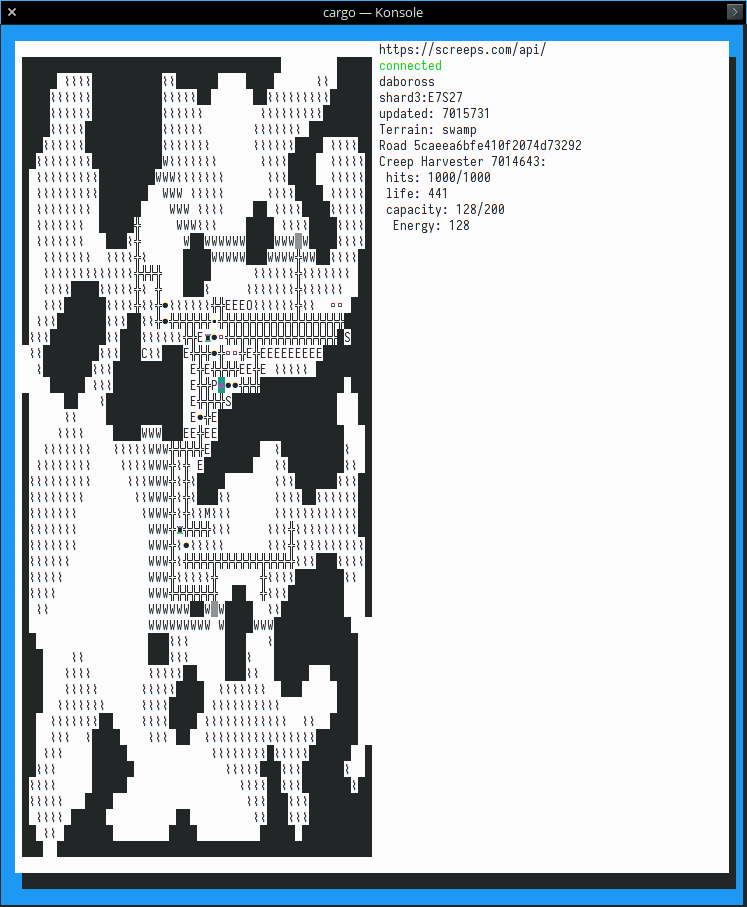

srv: screeps room view
======================
[![Build Status][travis-image]][travis-builds]

A TUI application allowing viewing [Screeps] servers/rooms.

Screeps is a true programming MMO where users uploading JavaScript code to power their online empires.

Uses the [rust-screeps-api] library for networking.

Current features:
- viewing rooms
- defaulting to a user's owned room when starting up
- navigating around room with arrow keys or hjlk
- viewing some information about objects under the current cursor
  - completed: creeps, terrain



TODO:
- viewing detailed information about remaining objects
- create video capture of functionality

## Building

```
# check source (for development)
cargo check

# run client
cargo run -- --token 'my_auth_token'
# to view options
cargo run -- --help

# run release build
cargo run --release -- --help
# or
cargo build --release
./target/release/srv --help
```

[travis-image]: https://travis-ci.org/daboross/srv-cli.svg?branch=master
[travis-builds]: https://travis-ci.org/daboross/srv-cli
[appveyor-builds]: https://ci.appveyor.com/project/daboross/srv-cli
[screeps]: https://screeps.com
[rust-screeps-api]: https://github.com/daboross/rust-screeps-api
