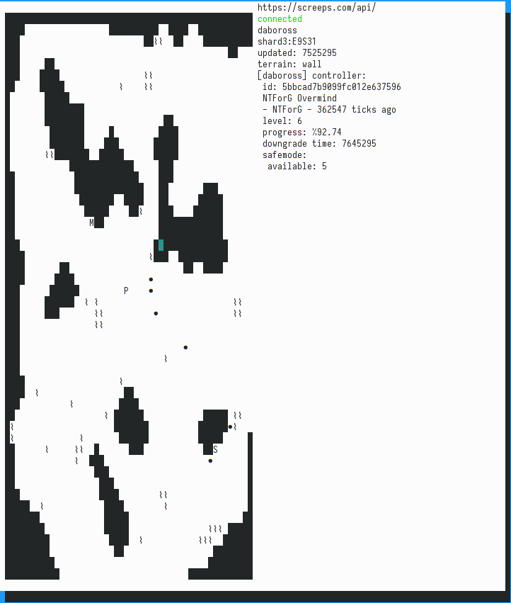

srv: screeps room view
======================
[![Build Status][travis-image]][travis-builds]

A TUI application allowing viewing [Screeps] servers/rooms.

Screeps is a programming MMO: users control their creeps with JavaScript, and the server itself is [open source](screeps-server)

Uses the [rust-screeps-api] library for networking.

Current features:
- viewing rooms
- defaulting to a user's owned room when starting up
- navigating around room with arrow keys or hjlk
- switching shards by pressing 's' key
- viewing basic information about objects under cursor

TODO:
- implement more controls besides just "move around the room"
- implement some display of what actions happened last tick
- implement other viewing modes
    - profiles
    - leaderboards
    - messages
    - console



## Building

Requires nightly Rust. Tested with `rustc 1.36.0-nightly (372be4f36 2019-05-14)`.

Options:

- Install snapshot of repository into PATH

  ```
  cargo install --git https://github.com/daboross/srvc.git
  ```
- Install from cloned repository
  ```
  cargo install --path .
  ```
- Run directly from repository

 ```
 # debug mode (faster compile, slower runtime)
 cargo run -- --token 'my_auth_token'
 cargo run -- --help

 # release
 cargo run --release -- --help
 # or
 cargo build --release
 ./target/release/srv --help
 ```

[travis-image]: https://travis-ci.org/daboross/srvc.svg?branch=master
[travis-builds]: https://travis-ci.org/daboross/srvc
[screeps]: https://screeps.com
[rust-screeps-api]: https://github.com/daboross/rust-screeps-api
[screeps-server]: https://github.com/screeps/screeps
